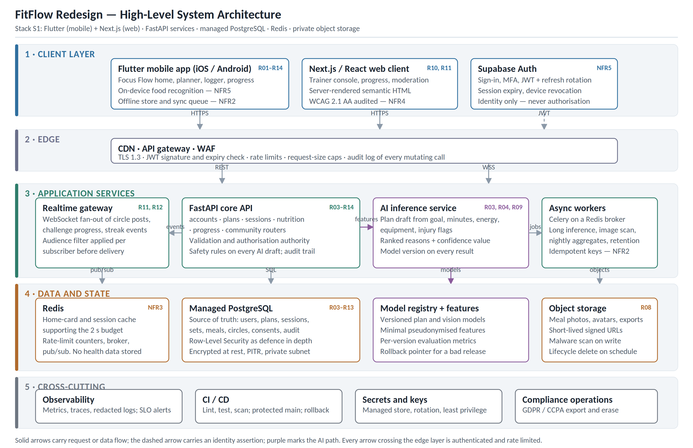

# FitFlow Redesign — Technology Evaluation and Architecture

Supporting repository for **IT3060 Human Computer Interaction, Lab Exercise 05**.

| | |
|---|---|
| **Student** | Jayawardhana O K T C — IT23230774 |
| **Group** | WE 1.1 · 3rd Year, Semester 2 |
| **Campus** | Malabe |
| **Case study** | FitFlow — mid-sized health-tech startup redesign |

---

## The problem this repository answers

FitFlow's store rating fell from 4.6 to 3.8 stars, retention declined over a year and 68% of users
abandoned the app shortly after onboarding. Lab Exercises 02–04 turned that research into sixteen user
requirements (R01–R16), five non-functional requirements (NFR1–NFR5), a selected interface direction
("Focus Flow") and a usability issue log (U01–U14) whose only Critical entry was a privacy failure.

Lab Exercise 05 asks which technology stack can actually deliver that design, and requires the answer to
be defended rather than asserted. Every comparison in `docs/` is scored against a requirement that already
exists in the requirement set, not against a general impression of the technology.

## Recommended stack

| Layer | Choice | Why |
|---|---|---|
| Mobile | **Flutter (Dart)** | Predictable frame behaviour for the set logger and rest timer; one TFLite integration covers both platforms (NFR1, NFR3, NFR5) |
| Web | **Next.js / React** | Server-rendered semantic HTML so WCAG 2.1 AA is achievable (NFR4) |
| Core API | **FastAPI (Python)** | Typed validation, generated OpenAPI contract, same language as the models |
| AI service | **FastAPI + Celery workers** | CPU-bound inference kept out of the API event loop |
| Database | **Managed PostgreSQL** | Transactional consistency across plan, session, sets and progress; RLS as defence in depth |
| Cache / events | **Managed Redis** | Home-card cache, rate limiting, pub/sub behind the realtime gateway |
| Identity | **Supabase Auth** | Standard JWTs; **authorisation stays in the API** |
| Media | **Private object storage** | Short-lived signed URLs, scan on write, lifecycle deletion |

Scored **4.33 / 5** against nine weighted criteria — see [`docs/03-decision-matrix.md`](docs/03-decision-matrix.md).
The matrix is honest about its own limits: under a no-new-hiring assumption the React Native alternative
scores 4.07 against 4.08, so the choice is a staffing decision as much as a technical one.

## Architecture



Full description, component responsibilities and the three critical data flows:
[`docs/04-architecture.md`](docs/04-architecture.md).

## Repository guide

```
docs/           comparison tables, decision matrix, architecture and ADRs
frontend/mobile Flutter client (iOS, Android)
frontend/web    Next.js client (trainer console, web experience)
backend/        FastAPI core API
ai-service/     FastAPI inference service and Celery workers
infra/          infrastructure as code, Docker Compose, database migrations
```

| Document | Contents |
|---|---|
| [`docs/01-frontend-comparison.md`](docs/01-frontend-comparison.md) | Flutter vs React Native vs Kotlin Multiplatform vs Swift |
| [`docs/02-backend-comparison.md`](docs/02-backend-comparison.md) | Backend frameworks, databases and identity providers |
| [`docs/03-decision-matrix.md`](docs/03-decision-matrix.md) | Weighted matrix, worked calculation, sensitivity analysis |
| [`docs/04-architecture.md`](docs/04-architecture.md) | Layers, components, data flows, cross-cutting controls |
| [`docs/05-requirements-trace.md`](docs/05-requirements-trace.md) | R01–R16 and NFR1–NFR5 mapped to components |
| [`docs/adr/`](docs/adr/) | ADR-001 to ADR-004 |

## Local setup

Prerequisites: Flutter 3.24+, Python 3.11+, Node 20+, Docker.

```bash
cp .env.example .env            # fill in local values; never commit .env

# infrastructure (PostgreSQL + Redis + object storage emulator)
docker compose -f infra/docker-compose.yml up -d

# core API            -> http://localhost:8000/docs
cd backend && python -m venv .venv && source .venv/bin/activate
pip install -r requirements.txt && uvicorn app.main:app --reload

# AI inference service -> http://localhost:8001/docs
cd ../ai-service && python -m venv .venv && source .venv/bin/activate
pip install -r requirements.txt && uvicorn app.main:app --reload --port 8001

# web client          -> http://localhost:3000
cd ../frontend/web && npm install && npm run dev

# mobile client
cd ../mobile && flutter pub get && flutter run
```

## Conventions

- Branch names carry the requirement they serve: `feat/R08-camera-first-nutrition`.
- Every pull request states the requirement or issue ID it closes and its test evidence.
- `main` is protected: review required, CI must pass, no force pushes.

## Status

Coursework artefact. The stack is a **proposal** supported by documented vendor capability, not a deployed
system; no load test, device profile or vendor quotation informed the ratings, and each document says so
where it matters.

## Licence

MIT — see [`LICENSE`](LICENSE).
